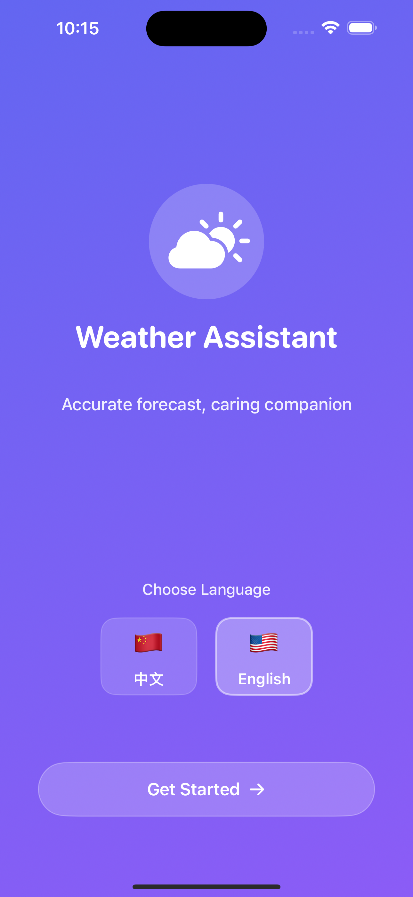
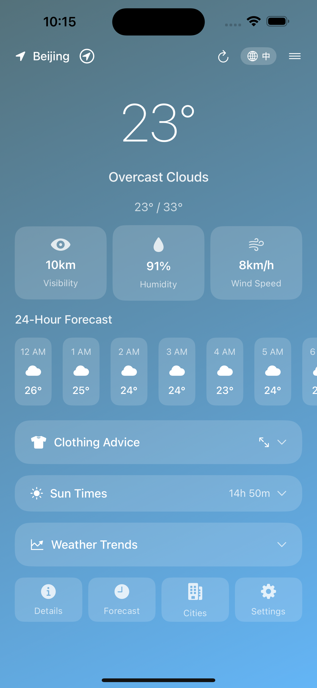
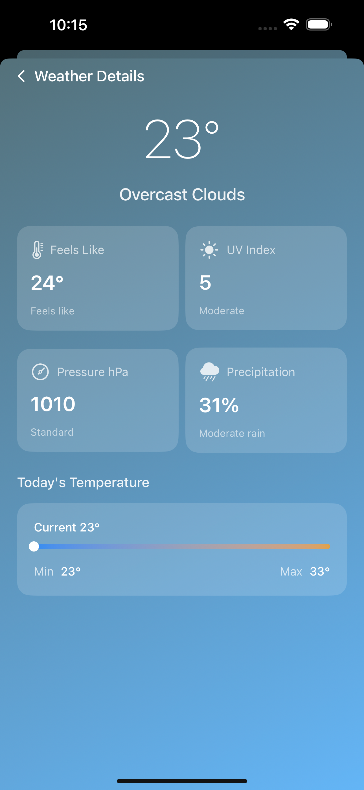
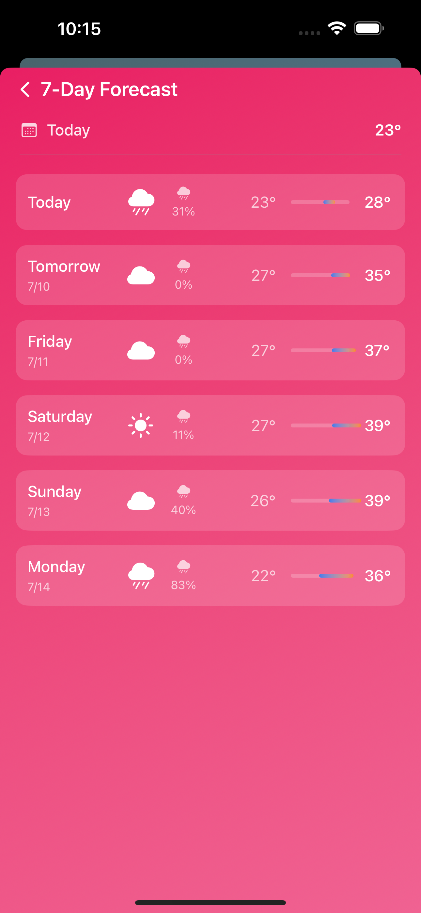
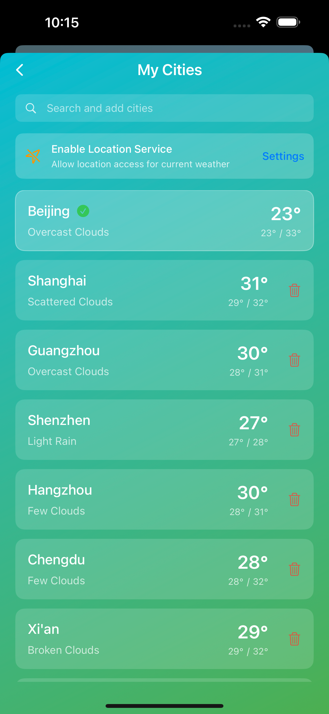

# AIWeather (WeathersPro)

🌤️ A beautiful, feature-rich weather app for iOS with an elegant marketing website.



## 🌟 Features

- **Accurate Weather Forecasts** - Real-time weather data with hourly and 7-day forecasts
- **Multiple Cities** - Track weather for multiple locations
- **Beautiful UI** - Dynamic backgrounds that change with weather conditions
- **Smart Notifications** - Weather alerts and daily forecast reminders
- **Bilingual Support** - Available in English and Chinese
- **Clothing Recommendations** - Get personalized advice based on weather
- **Sunrise/Sunset Times** - Plan your day with detailed sun information
- **Weather Trends** - Visual charts for temperature and precipitation

## 📱 App Screenshots

<p align="center">
  
  
  
  
</p>

## 🌐 Marketing Website

Visit our marketing website: [https://weiproduct.github.io/AIWeather/](https://weiproduct.github.io/AIWeather/)

The website features:
- Responsive design for all devices
- Beautiful animations and interactions
- Comprehensive privacy policy and terms
- App Store download links
- Feature showcase with real app screenshots

## 🛠️ Technical Stack

### iOS App
- **SwiftUI** - Modern declarative UI framework
- **Swift** - Primary programming language
- **CoreLocation** - Location services
- **SwiftData** - Local data persistence
- **WidgetKit** - Home screen widgets
- **OpenWeatherMap API** - Weather data provider

### Website
- **HTML5/CSS3** - Modern web standards
- **JavaScript** - Interactive features
- **GitHub Pages** - Free hosting
- **Responsive Design** - Mobile-first approach

## 📂 Project Structure

```
AIWeather/
├── Weather/              # iOS app source code
│   ├── Models/          # Data models
│   ├── Views/           # SwiftUI views
│   ├── ViewModels/      # MVVM view models
│   ├── Services/        # API and services
│   └── Utilities/       # Helper functions
├── WeatherWidget/       # iOS widget extension
├── docs/               # Marketing website
│   ├── index.html      # Homepage
│   ├── assets/         # Images and resources
│   └── styles.css      # Styling
└── vercel-proxy/       # API proxy server
```

## 🚀 Getting Started

### iOS App Development

1. Clone the repository
   ```bash
   git clone https://github.com/WeiProduct/AIWeather.git
   cd AIWeather
   ```

2. Open in Xcode
   ```bash
   open Weather.xcodeproj
   ```

3. Configure API key
   - Get an API key from [OpenWeatherMap](https://openweathermap.org/api)
   - Add to your Xcode build settings or use the proxy server

4. Build and run
   - Select your target device
   - Press ⌘R to build and run

### Website Development

1. Navigate to docs folder
   ```bash
   cd docs
   ```

2. Open in browser
   ```bash
   open index.html
   ```

3. Make changes and test locally

## 🌍 Deployment

### iOS App
- Build archive in Xcode
- Upload to App Store Connect
- Submit for review

### Website
The website is automatically deployed to GitHub Pages when you push to the main branch.

## 📄 License

This project is proprietary software. All rights reserved.

## 🤝 Contributing

This is a private project. Contributions are not accepted at this time.

## 📧 Contact

For support or inquiries:
- Email: support@weatherspro.com
- GitHub Issues: [Create an issue](https://github.com/WeiProduct/AIWeather/issues)

---

Made with ❤️ by WeiProduct